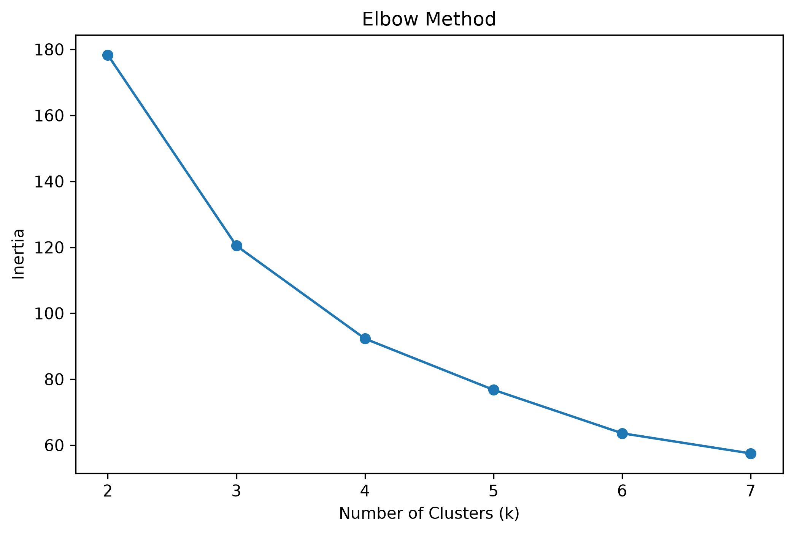
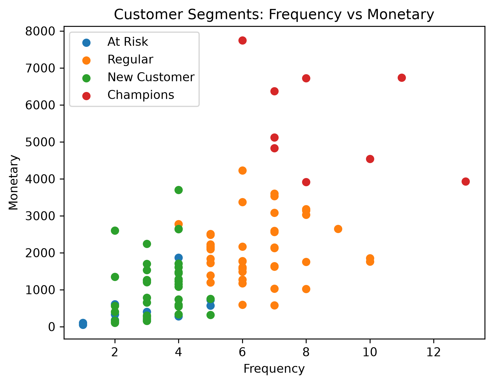

# Task #16 — Customer Segmentation using RFM and K-Means

## 1. Introduction

يهدف هذا التحليل إلى فهم سلوك العملاء وتقسيمهم إلى مجموعات متشابهة باستخدام تحليل **RFM** وخوارزمية **K-Means Clustering**.

يعتمد تحليل RFM على ثلاثة مؤشرات رئيسية:

* **Recency:** عدد الأيام منذ آخر عملية شراء للعميل.
* **Frequency:** عدد عمليات الشراء.
* **Monetary:** إجمالي المبلغ الذي أنفقه العميل.

يساعد الجمع بين هذه المؤشرات على فهم قيمة العملاء بشكل أفضل من الاعتماد على إجمالي الإنفاق فقط، ومن ثم اختيار استراتيجية تسويقية مناسبة لكل مجموعة.

### أمثلة على القرارات التسويقية

* العميل ذو **Recency مرتفعة وFrequency مرتفعة** كان يشتري بشكل متكرر، لكن مر وقت طويل منذ آخر شراء؛ يمكن إرسال عرض شخصي أو خصم بهدف إعادة تنشيطه.
* العميل ذو **Recency منخفضة وFrequency منخفضة** اشترى مؤخرًا لكنه لم يكرر الشراء كثيرًا؛ يمكن استخدام توصيات المنتجات أو عرض تشجيعي لتحفيزه على تكرار الشراء.

---

# 2. RFM Calculation and K-Means

تم حساب مؤشرات RFM لكل عميل باستخدام:

* آخر تاريخ شراء لحساب **Recency**.
* عدد الطلبات لحساب **Frequency**.
* مجموع الإيرادات لحساب **Monetary**.

بعد ذلك تم استخدام `StandardScaler` لتوحيد المقاييس قبل تطبيق K-Means، لأن المتغيرات الثلاثة لها نطاقات مختلفة.

## Elbow Method

تم اختبار قيم `k` من 2 إلى 7 باستخدام **Elbow Method**.

بناءً على شكل المنحنى، تم اختيار:

**k = 4**

بعد ذلك تم تطبيق خوارزمية K-Means باستخدام أربع مجموعات.

---

# 3. Cluster Interpretation

يوضح الجدول التالي متوسط قيم RFM لكل مجموعة:

| Segment | Segment Name | Average Recency | Average Frequency | Average Monetary |
| ------: | ------------ | --------------: | ----------------: | ---------------: |
|       0 | At Risk      |          425.70 |              2.90 |           511.50 |
|       1 | Regular      |           73.66 |              6.49 |          2108.41 |
|       2 | New Customer |          138.74 |              3.28 |          1043.46 |
|       3 | Champions    |           86.33 |              8.56 |          5545.00 |

## 0 — At Risk

**الوصف:**

عملاء مرّ وقت طويل منذ آخر عملية شراء لهم، ولديهم تكرار وإنفاق منخفضان نسبيًا.

**الإجراء التسويقي:**

إرسال عروض شخصية أو خصومات لإعادة تنشيطهم وتشجيعهم على الشراء مرة أخرى.

---

## 1 — Regular

**الوصف:**

عملاء ذوو سلوك شرائي منتظم، مع قيم متوسطة نسبيًا في Recency وFrequency وMonetary.

**الإجراء التسويقي:**

تقديم عروض دورية وبرامج تشجيعية لزيادة تكرار الشراء أو متوسط قيمة المشتريات.

---

## 2 — New Customer

**الوصف:**

عملاء لديهم عدد محدود نسبيًا من عمليات الشراء وإنفاق أقل مقارنة بالمجموعات الأعلى قيمة، مما يشير إلى أن علاقتهم الشرائية ما زالت محدودة.

**الإجراء التسويقي:**

تشجيعهم على تكرار الشراء من خلال عروض مناسبة وتوصيات لمنتجات مرتبطة بمشترياتهم السابقة.

---

## 3 — Champions

**الوصف:**

عملاء ذوو قيمة مرتفعة، لديهم أعلى متوسط في Frequency وأعلى متوسط في Monetary ضمن المجموعات.

**الإجراء التسويقي:**

الحفاظ عليهم من خلال برامج الولاء والمكافآت والعروض الحصرية.

---

# 4. Customer Distribution

يوضح الجدول التالي عدد العملاء ونسبة كل Segment من إجمالي العملاء:

| Segment | Segment Name | Customer Count | Percentage |
| ------: | ------------ | -------------: | ---------: |
|       0 | At Risk      |             10 |     10.10% |
|       1 | Regular      |             41 |     41.41% |
|       2 | New Customer |             39 |     39.39% |
|       3 | Champions    |              9 |      9.09% |

تمثل **Regular** أكبر مجموعة من العملاء بنسبة **41.41%**، تليها **New Customer** بنسبة **39.39%**.

أما **Champions** فتضم 9 عملاء فقط، أي **9.09%** من إجمالي العملاء.

---

# 5. Revenue by Segment

يوضح الجدول التالي إجمالي الإيرادات ونسبة مساهمة كل Segment من إجمالي الإيرادات:

| Segment | Segment Name | Total Revenue | Revenue Percentage |
| ------: | ------------ | ------------: | -----------------: |
|       1 | Regular      |        86,445 |             47.46% |
|       3 | Champions    |        49,905 |             27.40% |
|       2 | New Customer |        40,695 |             22.34% |
|       0 | At Risk      |         5,115 |              2.81% |

من حيث **إجمالي الإيرادات**، كانت مجموعة **Regular** الأعلى مساهمة، حيث حققت:

**86,445**

وبنسبة:

**47.46% من إجمالي الإيرادات.**

ومن المهم التمييز بين إجمالي إيرادات المجموعة ومتوسط قيمة العميل. فعلى الرغم من أن **Champions** لديها أعلى متوسط Monetary، إلا أن عدد عملائها أقل من Regular، ولذلك كان إجمالي إيرادات Regular أعلى.

---

# 6. Customer Segments Visualization

يوضح الرسم التالي العلاقة بين **Frequency** و **Monetary** للعملاء، مع تمييز كل Segment:

يساعد هذا الرسم على ملاحظة الاختلاف بين المجموعات من حيث عدد عمليات الشراء وإجمالي الإنفاق.

---

## 7. Final Findings

أظهر تحليل RFM وجود أربع مجموعات رئيسية من العملاء تختلف في سلوك الشراء وقيمتها بالنسبة للمتجر.

تضم مجموعة **Regular** العملاء الأكثر مساهمة في الإيرادات، حيث حققت **47.46%** من إجمالي الإيرادات بقيمة **86,445**. أما مجموعة **Champions** فتمثل العملاء الأعلى من حيث تكرار الشراء ومتوسط الإنفاق، وساهمت بنسبة **27.40%** من الإيرادات، أي ما قيمته **49,905**. بينما ساهمت مجموعة **New Customers** بنسبة **22.34%** بقيمة **40,695**، في حين كانت مساهمة مجموعة **At Risk** هي الأقل، بنسبة **2.81%** وبقيمة **5,115**.

بناءً على ذلك، تتمثل التوصية العملية الرئيسية في الحفاظ على العملاء في مجموعة **Regular** وتعزيز ولائهم من خلال عروض مخصصة وبرامج ولاء تشجعهم على الاستمرار في الشراء، نظرًا لمساهمتهم الأكبر في إجمالي الإيرادات. وبالتوازي، يمكن استهداف عملاء مجموعة **At Risk** بحملات إعادة تنشيط وعروض لاستعادتهم، بينما يمكن تشجيع **New Customers** على تكرار الشراء، والاستمرار في المحافظة على علاقة قوية مع **Champions** من خلال برامج الولاء والعروض الحصرية.

---

# 8. Conclusion

يوضح تحليل RFM مع K-Means أن تقسيم العملاء لا يعتمد على مؤشر واحد فقط، بل يجمع بين حداثة الشراء وتكراره وقيمته المالية.

يساعد هذا التقسيم في تحويل بيانات المبيعات إلى مجموعات واضحة يمكن استخدامها لدعم القرارات التسويقية واستهداف العملاء بطريقة أكثر ملاءمة لسلوك كل مجموعة.

وبناءً على النتائج، كانت **Regular** المجموعة الأعلى من حيث إجمالي الإيرادات، بينما كانت **Champions** المجموعة ذات أعلى متوسط للإنفاق والتكرار على مستوى العميل.
